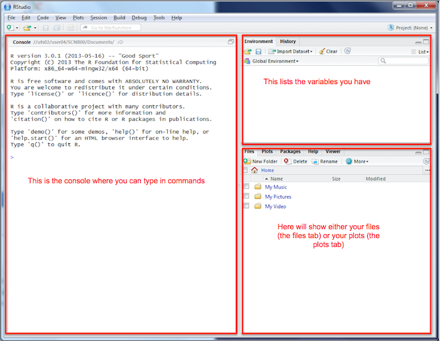

Learning Outcomes: | R Functions & Libaries:  
-------- | --------  
Use R to read in CSV data (pg. 4) |  `read.csv()` (pg. 4)  
Use R to read in spatial data (pg. 5) | `readShapeSpatial()` (pg. 6)  
Know how to plot spatial data using R (pg. 6) | `plot()` (pg. 6)  
Join spatial data to attribute data (pg. 6) | `merge()` (pg. 6)  
Customize colour and classification methods (pg. 10)  | `classIntervals()` (pg. 10)
Understand how to use loops to make multiple maps (pg. 11) | `for() {}` (pg. 11)  
Know how to reproject spatial data (pg. 13) | `spTransform()` (pg. 13)  
Be able to perform point in polygon operations (pg. 14) | `gContains()` (pg. 14)  
Know how create a 'heat-map' style map using point data (pg. 16) |  `spatstat` library (pg. 16) 


## R Basics

R began as a statistics program, and is still used as one by many users. At a simple level you can type in "3 + 4", press return, and R will respond "7". The code you type in in this tutorial is shown like this:

```{r, comment=NA, eval=FALSE}
3 + 4
```

And R's output is shown like this: 

```{r, echo=FALSE, comment=NA}
7
```

R has developed into a GIS as a result of user contributed packages, or libraries, as R refers to them. We will be using several libraries in this practical, and will load them as necessary. If you are not using one of the University computers, you will need to install the R libraries, as well as loading them. To do this, run `install.packages("package_name")`.

We won't spend too much time on the basics of using R - if you want to find out more, there are some good tutorials at http://www.social-statistics.org/?p=764 or http://rpubs.com/nickbearman/gettingstartedwithr. 

We are going to use a program called [RStudio](http://www.rstudio.com/ "R Studio website"), which works on top of R and provides a good user interface. I'll talk a little bit about it in the presentation, but the key areas of the window are these:



Open up R Studio (click **Start > All Programs > RStudio > RStudio** or double-click the icon on the desktop). 

R can initially be used as a calculator - enter the following into the left hand side of the window - the section labeled **Console**:
```{r,eval=FALSE}
6 + 8
```

Don't worry about the `[1]` for the moment - just note that R printed out `14` since this is the answer to the sum you typed in.  In these worksheets, sometimes I show the results of what you have typed in.  This is in the format shown below:
```{r, comment=NA}
5 * 4
```
Also note that `*` is the symbol for multiplication here - the last command asked R to perform the calculation '5 times 4'.  Other symbols are `-` for subtraction and `/` for division:
```{r, comment=NA}
12 - 14
6 / 17
```


You can also assign the answers of the calculations to variables,  and use them in calculations.  You do this as below
```{r, comment=NA}
price <- 300
```
Here,  the value `300` is stored in the variable `price`.  The `<-` symbol means put the value on the right into the variable on the left, it is typed with a `<` followed by a `-`. The variables are shown in the window labeled 'Environment', in the top right. Variables can be used in subsequent calculations.  For example, to apply a 20% discount to this price,  you could enter the following:
```{r, comment=NA}
price - price * 0.2 
```

or use intermediate variables:
```{r,tidy=FALSE, comment=NA}
discount <- price * 0.2
price - discount
```

R can also work with lists of numbers,  as well as individual ones. Lists are specified using the `c` function.  Suppose you have a list of house prices listed in an estate agents,  specified in thousands of pounds.  You could store them in a variable called `house.prices` like this:

```{r, comment=NA}
house.prices <- c(120,150,212,99,199,299,159)
house.prices
```
Note that there is no problem with full stops in the middle of variable names.

You can then apply functions to the lists.  For example to take the average of a list,  enter:
```{r, comment=NA}
mean(house.prices)
```
If the house prices are in thousands of pounds,  then this tells us that the mean house price is £176,900.  Note that on your display,  the answer may be displayed to more significant digits,  so you may have something like `r mean(house.prices)` as the mean value.

The Data Frame
------------
While it is possible to type data into R by hand, it is laborious to say the least. R has a way of storing data in an object called a **data frame**. This is rather like an internal spreadsheet where all of the relevant data items are stored together as a set of columns.  This is similar to the data set storage in SPSS (for those of you who have used that package) where each variable corresponds to a column and each case (or observation) corresponds to a row. However,  while SPSS can only have one data set active at a time, in R you can have several of them.

We have a CSV file of house prices and burglary rates, which we can load into R. We can use a function called `read.csv` which, as you might guess, reads CSV files. Run the line of code below, which loads the CSV file into a variable called `hp.data`. 

<!-- There are various data files used for this workshop. Ideally I would pull them in directly from GitHub with code, but I can't work out how to do this. A copy of all the data used is in the data sub-directory. Using https://raw.githubusercontent.com/nickbearman/intro-r-spatial-analysis/master/data/hpdata.csv just gives an error message. -->

```{r getdata}
hp.data <- read.csv("http://nickbearman.me.uk/data/20150427-liv/hpdata.csv")
```

When we read in data, it is always a good idea to check it came in ok. To do this, we can preview the data set. The `head` command shows the first 6 rows of the data.

```{r, comment=NA}
head(hp.data)
```

You can also click on the variable listed in the Environment window, which will show the data in a new tab. You can also enter:

```
fix(hp.data)
```
to view this data frame in a window,  and also edit values in the 'cells'.  However,  although it might be interesting to try using `fix` now,  try it, but don't actually edit anything.  To return to the RStudio command line, close the data frame window. **NOTE: it is important to do this,  otherwise you won't be able to type anything in to R**.

You can also describe each column in the data set using the `summary` function:
```{r, comment=NA}
summary(hp.data)
```
For each column,  a number of values are listed:

Item    | Description
--------|----------------------------------------------------------------------------
Min.    | The smallest value in the column
1st. Qu.| The first quartile (the value 1/4 of the way along a sorted list of values)
Median  | The median (the value 1/2 of the way along a sorted list of values)
Mean    | The average of the column
3rd. Qu.| The third quartile (the value 3/4 of the way along a sorted list of values)
Max.    | The largest value in the column

Between these numbers,  an impression of the spread of values of each variable can be obtained. In particular it is possible to see that the median house price in St. Helens by neighbourhood ranges from £65,000 to £260,000 and that half of the prices lie between £152,500 and £210,000.  Also it can be seen that since the median measured burglary rate is zero,  then at least half of areas had no burglaries in the month when counts were compiled.

Now is a good time to remind you to save your data on a regular basis. This is particularly important if you are working on coursework, and want to stop half-way through. R has a number of different elements you can save. The workspace is the most important element, as it contains any data frames or other objects you have created; i.e. everything listed in the 'Environment' tab, like the `hp.data` object we created earlier. To do this, click the save button in the Environment tab. Choose somewhere to save it (your Documents folder is a good place) and give it a name. To load these in a new session, click File > Open and select your file.

Geographical Information
-------------------------

Until now,  although this is geographical data,  no maps have been drawn.  In this section you will do this.  Firstly,  you need to load some new *packages* into R - a package is an extra set of functionality that extends what R is capable of doing.  Here, one of the new package is called `maptools` and it extends R by allowing it to draw maps, and handle geographical information.  The packages are already installed, so all you need to do is to let R know you want to use the packages:

```{r,message=FALSE,display=FALSE}
library(maptools)
library(classInt)
library(RColorBrewer)
```

However,  this just makes R *able* to handle geographical data, it doesn't actually load any specific data sets.  To do this,  you'll need to obtain them from somewhere. Data for maps in R can be read in from **shapefiles** - these are a well known geographical information exchange format.The first task is to obtain a shapefile set of the St. Helens neighbourhoods (or Lower layer Super Output Areas - LSOAs,  as they are more formally called).  To do this,  you will need to put some information into a working folder.  

R uses working folders to store information relevant to the current project you are working on. I suggest you make a folder called **R work** in the M: drive (using Computer in the Start Menu). Then we need to tell R where this is, so click **Session > Set Working Directory > Choose Directory** and selecting the folder that you created. 

As with most programs, there are multiple ways to do things. For instance, to set the working directory we could type: `setwd("M:/R work")`. Your version might well have a longer title, depending on what you called the folder. Also note that slashes are indicated with a '*/*' not '\\'. 

There is a set of shapefiles for the St. Helens neighbourhoods at the same location as the data set you read in earlier. Since several files are needed,  I have bundled these together in a single zip file.  You will now download this to your local folder and subsequently unzip it. This can all be done via R functions:

```{r, comment=NA}
download.file("http://www.nickbearman.me.uk/data/20150427-liv/sthel.zip","sthel.zip")
unzip("sthel.zip")
```

The first function actually downloads the zip file into your working folder,  the second one unzips it,  creating the shapefile set. All of the shapefile set files begin with `sthel` but then have different endings,  e.g. `sthel.shp`, `sthel.dbx` and `sthel.shx`.
Now,  these can be read in to a `SpatialPolygons` object.

```{r, comment=NA}
sthel <- readShapeSpatial("sthel")
```
The `readShapeSpatial` function does this,  and stores them into another type of object called a `SpatialPolygons` object.  These polygons are areas or regions,  such as the neighbourhoods (LSOAs) in St. Helens.  You can use the `plot` function to draw the polygons (i.e. the map of the LSOAs).

```{r, comment=NA}
plot(sthel)
```

We can also look at the data for each LSOA (in R this is known as the `data` slot, and is the same as the attribute table in programs like ArcGIS, QGIS or MapInfo.)

```{r, eval=F,comment=NA}
head(sthel@data)
```
  
  
  
```{r, echo=F,comment=NA}
head(sthel@data[,1:7])
```

You can see there is a lot of information there, but the useful bit is the `SP_ID` field. You may have spotted that these IDs match those in the `hp.data` file - we can use this to join the two data sets together, and then show the Burglary rates (from `hp.data`) on the map. The idea is that there is a field in each data set that we can use to join the two together; in this case we have the `ID` field in `sthel` and the `SP_ID` field in `hp.data`. 

```{r, comment=NA}
#create the new variable sthel.prices
sthel.prices <- sthel
#merge with hp.data
sthel.prices@data <- merge(sthel@data,hp.data,by.x="SP_ID",by.y="ID", all.x=TRUE)
```
 
Now that we have joined the data together, we can draw a choropleth map of these house prices.  In later exercises more will be explained as to how this works, but for now the method will simply be demonstrated.  

```{r, eval = F, comment=NA}
var <- sthel.prices@data[,"Burglary"]
breaks <- classIntervals(var, n = 6, style = "fisher")$brk
my_colours <- brewer.pal(6, "Greens")
plot(sthel.prices, col = my_colours[findInterval(var, breaks, all.inside = TRUE)],
     axes = FALSE, border = rgb(0.8,0.8,0.8))
breaks <- list(b=breaks,c=my_colours)
```

```{r, echo=F, comment=NA}
var <- sthel.prices@data[,"Burglary"]
breaks <- classIntervals(var, n = 6, style = "fisher")$brk
my_colours <- brewer.pal(6, "Greens")
plot(sthel.prices, col = my_colours[findInterval(var, breaks, all.inside = TRUE)],
     axes = FALSE, border = rgb(0.8,0.8,0.8))
breaks <- list(b=breaks,c=my_colours)
```

For now, just copy and paste this into R and hit return. Don't worry about trying to interpret it!  Note that it is important to make sure the upper and lower case letters you type in are **exactly** the same as the ones above.  This is generally the case with R.  

The map shows the different burglary rates,  with dark shading indicating a higher rate. However,  this is much easier to interpret if you add a legend to the map.  For now,  just enter the following. As before,  more about how all of the commands work will be disclosed later in the course.

```{r,eval=FALSE}
legend(x = 357000, y = 393000, legend = leglabs(breaks$b), fill = breaks$c, bty = "n", 
       cex = 0.8)
```

You can also add a title to the map:
```{r,eval=FALSE}
title('Burglary Rates per 10,000 Homes in St. Helens')
```
As a final useful technique you can copy and paste maps like this into Word documents.  Click on the Export button, and then choose Copy to Clipboard.... Then choose Copy Plot. If you also have Word up and running, you can then paste the map into your document.

#Making a Map with Census Data

Now we are going to use the same principle to create a map of some data from the 2011 Census. We need to download the data, and although there are other sources of these data, in this example we will use the http://www.neighbourhood.statistics.gov.uk website.

- Navigate to the site and select the “Topics” link on the bottom left hand side of the page. 
- Click “Census” -> “2011 Census: Key Statistics”. 
- Then click the radio button that corresponds to “Age Structure, 2011 (KS102EW)” and press the “Next” button at the bottom right hand side of the page.
- Then click the related radio button for “Download” and press the “Next” button on the bottom right hand side of the page. 
- Select the radio button for the 2011 Statistical Geography Hierarchy (North West). 
- Press the “Next” button on the bottom right hand side of the page, and on the following page, download the Excel file by clicking on the “Microsoft Excel [*.xls]”. 

This will be zipped, and once you have extracted it you will find it contains a variety of files. You are interested in the file named `“KS102EW_2596_2011SOA_NW.xls”`. Copy this to the working directory you defined earlier (probably M:/r work). 

Open this file up in Excel, and you can see there are a number of different tabs, covering different geographies. We are interested in the LSOA geographies, so select the LSOA tab and look at the data it contains. You can see that there are a series of lines at the top which do not contain the data or headings for the columns. As such, we need to read this in R, skipping the unwanted lines and setting the column headings as the row containing “LSOA_CODE”. R can't directly import Excel files, but it can import CSV files, so make sure you have the LSOA tab open in Excel, and then save this as a CSV file. Excel will tell you you can only save the active sheet (i.e. the one currently open), which is fine. Follow the instructions and make sure you save the CSV file (using the default name of KS102EW_2596_2011SOA_NW.csv) in your working folder. 

Run the command below to read in the CSV file. The `skip = 5` bit tells R to ignore the first 5 rows, and the `header = TRUE` tells R to assign the next row as variable names. 

```{r, echo=FALSE, comment=NA}
download.file("http://www.nickbearman.me.uk/data/20150427-liv/KS102EW_2596_2011SOA_NW.csv","KS102EW_2596_2011SOA_NW.csv")
```

```{r, comment=NA}
#read in csv file, skipping the first 5 rows
pop2011 <- read.csv('KS102EW_2596_2011SOA_NW.csv', header = TRUE, skip = 5)
```

Then run `head` to see that the data has been read in correctly. *R will show all 45 variables, where as I've only shown the first 7 in the handout*. 

```{r, eval=F}
head(pop2011)
```

```{r, echo=F,comment=NA}
head(pop2011[,1:7])
```

You can see that some of the variable names are missing. The names were in the Excel spreadsheet, but spread over the first 5 rows, so they didn't import into R correctly. 

We can rename the columns, so that when we run the `head` command, R lists the correct names. This will also help us refer to the columns later on. Run the code below, which creates a new variable which contains the names (`newcolnames`) and then applies it to the `pop2011` data frame. Any column name ending in a 'c' is a count (of people in that age group in that LSOA) and any column ending in 'pc' is a percentage. *We've have to use 'pc' because R doesn't like symboles (e.g. %) in field names*.

It's also worth noting here that any line of code that starts with a `#` is a comment - i.e. R will ignore that line and move onto the next. I've included them here so you can see what is going on, but you don't need to type them in.  

```{r, comment=NA}
#create a new variable which contains the new variable names
newcolnames <- c("AllUsualResidentsc","Age0to4c","Age0to4pc","Age5to7c","Age5to7pc",
"Age8to9c","Age8to9pc","Age10to14c","Age10to14pc","Age15c","Age15pc","Age16to17c",
"Age16to17pc","Age18to19c","Age18to19pc","Age20to24c","Age20to24pc","Age25to29c",
"Age25to29pc","Age30to44c","Age30to44pc","Age45to59c","Age45to59pc","Age60to64c",
"Age60to64pc","Age65to74c","Age65to74pc","Age75to84c","Age75to84pc","Age85to89c",
"Age85to89pc","Age90andOverc","Age90andOverpc","MeanAge","MedianAge")
#apply these to pop2011 data frame
colnames(pop2011)[11:45] <- newcolnames
```

Now we have the correct column names for the data frame. It would also be good to check they have been applied to the `pop2011` dataframe correctly. 

Now we have the attribute data (percentage of people in each age group in each LSOA in this case) we need to join this attribute data to the spatial data. Therefore, first, we need to download the spatial data. 

- Go to http://census.edina.ac.uk/ and select Boundary Data Selector. 
- Then set Country to England, Geography to Statistical Building Block, dates to 2011 and later, and click 'Find'.
- Select 'English Lower Layer Super Output Areas, 2011' and click 'List Areas'. 
- Select 'Liverpool' from the list and click 'Extract Boundary Data'. 
- Click 'Go to Bookmark Facility' and you should be able to download the data after a 10 to 30 second wait. 

Extract the files, and move all the files starting with the name `england_lsoa_2011Polygon` to your working folder. There should be 5 files - make sure you move them all. Then read in the data:

```{r, echo=FALSE, comment=NA}
download.file("http://www.nickbearman.me.uk/data/20150427-liv/england_lsoa_2011Polygon.zip","england_lsoa_2011Polygon.zip")
unzip("england_lsoa_2011Polygon.zip")
```

```{r, comment=NA}
#read in shapefile
LSOAs <- readShapeSpatial("england_lsoa_2011Polygon")
```

Like earlier, we can use the `plot` command to preview the data. Try `plot(LSOAs)`. We can also apply the same technique with `head()` to the attribute table. Remember we need to use `head(LSOAs@data)` because this is a spatial data frame. 

The next stage is to join the attribute data to the spatial data, like we did in the exercise earlier. See if you can see how I have changed the code from earlier. 

```{r, comment=NA}
#join attribute data to LSOAs
LSOAs@data <- merge(pop2011,LSOAs@data,by.x="LSOA_CODE",by.y="code")
```

And use the `head` command to check it has joined correctly...

```{r, eval=F}
head(LSOAs@data)
```

```{r, echo=F,comment=NA}
head(LSOAs@data[,1:6])
```

#Making Maps

Now we have all the data setup, we can actually create the map. Run the code below, which is the same as the code we used earlier. 

<!-- Code for students in R Studio -->
```{r, eval=F,comment=NA}
#select variable
var <- LSOAs@data[,"Age0to4pc"]
#set colours & breaks
breaks <- classIntervals(var, n = 6, style = "fisher")$brk
my_colours <- brewer.pal(6, "Greens")
#plot map
plot(LSOAs, col = my_colours[findInterval(var, breaks, all.inside = TRUE)], axes = FALSE, 
     border = rgb(0.8,0.8,0.8))
#setup breaks for legend, and draw legend
breaks <- list(b=breaks,c=my_colours)
legend(x = 328130, y = 386506.5, legend = leglabs(breaks$b), fill = breaks$c, bty = "n")
```

<!-- Code for correct PDF rendering -->
```{r, echo=F,comment=NA}
#select variable
var <- LSOAs@data[,"Age0to4pc"]
#set colours & breaks
breaks <- classIntervals(var, n = 6, style = "fisher")$brk
my_colours <- brewer.pal(6, "Greens")
#plot map
plot(LSOAs, col = my_colours[findInterval(var, breaks, all.inside = TRUE)], axes = FALSE, 
     border = rgb(0.8,0.8,0.8))
#setup breaks for legend, and draw legend
breaks <- list(b=breaks,c=my_colours)
legend(x = 328030, y = 387506.5, legend = leglabs(breaks$b), fill = breaks$c, bty = "n", cex = 0.7)
```

This code draws the map, and adds a legend. Due to the way R works, we have to build up the map in stages, and each line of code adds a different element to the map. With blocks of code like this (and in fact, with all code) it is important to add comments, so we can remind ourselves what the different bit of code do. Comments in R are preceded with a #, as you can see above. 

Running multiple lines of code is where R scripts are useful - they allow you to run a  series of commands in sequence, and be able to update one or two lines without having to retype all of the code. Create a new script (**File > New File > R Script**) and paste the code in there. Then you can select the lines you wan to run by highlighting them, and then pressing `Ctrl+Enter`. Experiment with this and with updating individual lines, as discussed below. 

The first line tells R which variable to plot (`#select variable`). Try altering the first line to `var <- LSOAs@data[,"Age5to7pc"]` and run the code again. Try generating maps for different variables (remember you can use `colnames(LSOAs@data)` to list the variables).

You can also add a title to the map, which is useful to say what variable you are mapping. Add this code to your script and run it. 

```{r,eval=FALSE}
title('Percentage of Population ages 0 to 4 in Liverpool')
```

Remember that any line starting with a `#` is a comment, and will be ignored by R. Comments are very useful for us to note what the code is doing, particularly when you come back to it 6 months later and can't remember what it is supposed to do!

#Colours and Catagories (optional exercise)

The second section of the code (`#set colours & breaks`) tells R how many categories to split the data into (`n = 6`) and which classification method to use (`style = "fisher"`). Try altering the number of categories. Type `?classIntervals` into the console to see the help file on this function, and explore the different options. See also if you can change the colours - explore the help file for details. 

#Scale Bar and North Arrow (optional exercise)

It is also good practice to add a scale bar and a north arrow to each of the maps you produce. Running this code will add these to the map:

```{r,eval=FALSE}
#Add North Arrow
SpatialPolygonsRescale(layout.north.arrow(2), offset= c(336030,382006), scale = 2000, 
                       plot.grid=F)
#Add Scale Bar
SpatialPolygonsRescale(layout.scale.bar(), offset= c(328030,381506), scale= 5000, 
                       fill= c("white", "black"), plot.grid= F)
#Add text to scale bar 
text(328030,381006,"0km", cex=.6)
text(328030 + 2500,381006,"2.5km", cex=.6)
text(328030 + 5000,381006,"5km", cex=.6)
```

Remember to adjust the position of these items if you need to. To help with this, there is the `locator()` function. In RStudio, type `locator()` into the console and press enter. When you move your mouse over the plots window (where the maps are) the mouse pointer will turn into a cross. If you click somewhere on the plot, and then click Finish, RStudio will give you the coordinates of the point you selected. You can then substitute these into the code to locate the legend / scale bar etc. wherever you wish. 

It might also be good to have a 'N' under the North arrow to explain what it means. Look at the parameter `cex` in the helpsheet - it allows you to resize items. Try applying this with the `text` function to add the 'N' in the appropriate place. 

#Exporting and Multiple Maps (optional exercise)

One way of saving the map is using the Export option in the plot window. We can also do this using code, by adding two lines: `pdf(file="image.pdf")` before the map code and `dev.off()` after the map code. Try it now, and R will save the map in your working directory. 

```{r, comment=NA, eval=FALSE}
pdf(file="image.pdf")
  var <- LSOAs@data[,"Age0to4pc"]
  breaks <- classIntervals(var, n = 6, style = "fisher")$brk
  my_colours <- brewer.pal(6, "Greens")
  plot(LSOAs, col = my_colours[findInterval(var, breaks, all.inside = TRUE)],   
       axes = FALSE, border = rgb(0.8,0.8,0.8))
  breaks <- list(b=breaks,c=my_colours)
  legend(x = 330130, y = 385506.5, legend = leglabs(breaks$b), fill = breaks$c, bty = "n")
  title('Percentage of Population ages 0 to 4 in Liverpool')
  #Add North Arrow
  SpatialPolygonsRescale(layout.north.arrow(2), offset= c(336030,382006), scale = 2000, 
                         plot.grid=F)
  #Add Scale Bar
  SpatialPolygonsRescale(layout.scale.bar(), offset= c(328030,381506), scale= 5000, 
                       fill= c("white", "black"), plot.grid= F)
  #Add text to scale bar 
  text(331030,379206,"0km", cex=.6)
  text(331030 + 2500,379206,"2.5km", cex=.6)
  text(331030 + 5000,379206,"5km", cex=.6)
dev.off()
```

Saving the map using code allows us to create multiple maps very easily. A variable (`mapvariables`) is used to list which variables should be mapped (using the column numbers), and then the line starting `for` starts a loop. Try running the code, and then change the variables it maps (remember `colnames(LSOAs@data)` will be useful).

```{r, comment=NA}
#setup variable with list of maps to print
mapvariables <- c(13,15,17)
#loop through for each map
for (i in 1:length(mapvariables)) {
  #setup file name
  filename <- paste0("map",colnames(LSOAs@data)[mapvariables[i]],".pdf")
  pdf(file=filename)
  #create map
  var <- LSOAs@data[,mapvariables[i]]
  #colours and breaks
  breaks <- classIntervals(var, n = 6, style = "fisher")$brk
  my_colours <- brewer.pal(6, "Greens")
  #plot map
  plot(LSOAs, col = my_colours[findInterval(var, breaks, all.inside = TRUE)], 
       axes = FALSE, border = rgb(0.8,0.8,0.8))
  breaks <- list(b=breaks,c=my_colours)
  #add legend
  legend(x = 330130, y = 384506.5, legend = leglabs(breaks$b), fill = breaks$c, bty = "n")
  #add title
  title(colnames(LSOAs@data)[mapvariables[i]])
  #Add North Arrow
  SpatialPolygonsRescale(layout.north.arrow(2), offset= c(336030,382006), scale = 2000, 
                         plot.grid=F)
  #Add Scale Bar
  SpatialPolygonsRescale(layout.scale.bar(), offset= c(328030,381506), scale= 5000, 
                       fill= c("white", "black"), plot.grid= F)
  #Add text to scale bar 
  text(331030,379206,"0km", cex=.6)
  text(331030 + 2500,379206,"2.5km", cex=.6)
  text(331030 + 5000,379206,"5km", cex=.6)
  dev.off()
}
```

#Clustering of Crime Points 

In this section we will look at a couple of different types of GIS analysis, using some crime data for Liverpool. These are just a couple of the analysis techniques that are available, and the aim is to teach you the techniques you need to know. Then you can apply these techniques to other data sets and other analytical methods in R.

We need to read in the crime data, and because the crime data is just a CSV file, we need to do some processing in order to get it as spatial data in R, including some reprojecting of the data (converting the coordinate system from WGS 1984 to BNG).

```{r, comment=NA,warning=FALSE,message=FALSE}
#load library
library(maptools)
#Read the data into a variable called crimes
crimes <- read.csv("http://nickbearman.me.uk/data/20150123-liv/police-uk-2014-04-merseyside-street.csv")
```

Now the CSV data has been read in, take a quick look at it using `head(crimes)`. You will see that the data consists of a number of columns, each with a heading. Two of these are called *Longitude* and *Latitude* – these are the column headers that give the coordinates of each incident in the data you have just downloaded. Another is headed *Crime.Type* and tells you which type of crime occurred. 

At the moment, the data is just in a data frame object - not any kind of spatial object.  To create the spatial object,  enter the following:

```{r, comment=NA,warning=FALSE,message=FALSE}
#setup variables for the different projection systems
latlong = "+init=epsg:4326" #WGS1984 / latitude & longitude
bng = "+init=epsg:27700" #BNG, British National Grid
#create crime points as spatial data, they are currently in latlong
coords <- cbind(Longitude = as.numeric(as.character(crimes$Longitude)), Latitude = 
                  as.numeric(as.character(crimes$Latitude)))
crime.pts <- SpatialPointsDataFrame(coords, crimes[, -(5:6)], 
                                    proj4string = CRS(latlong))
```

This creates a ```SpatialPointsDataFrame``` object. This fifth line (starting `coords`) prepares the coordinates into a form that the ```SpatialPointsDataFrame``` can use. The ```SpatialPointsDataFrame``` function on the sixth line takes three arguments - the first is coordinates, created in the line above. The second argument is the data frame *minus* columns 5 and 6 - this is what ```-(5:6)``` indicates.  These columns provide all the non-geographical data from the data frame.  The third is the coordinate system that the data is currently in. The resulting object ```crime.pts``` is a spatial points geographical shape object,  whose points are each recorded crime in the data set you download. Try `head(crime.pts@data)` to see the attribute table, similar to earlier. 

We also need to reproject the data, from Latitude Longitude, to British National Grid:

```{r, comment=NA,warning=FALSE,message=FALSE}
#reproject to British National Grid, from Latitude Longitude
library(rgdal)
crime.pts <- spTransform(crime.pts, CRS(bng))
```

To see the geographical pattern of these crimes,  enter:
```{r}
plot(crime.pts,pch='.',col='darkred')
```

We can see the rough outline of the Merseyside Police area, as well as the path of the River Mersey. The option ```pch='.'``` tells R to map each point with a full-stop character - and to make the colour of these dark red.

You can also examine the kinds of different crimes recorded.
```{r, eval=FALSE,comment=NA,warning=FALSE,message=FALSE}
table(crime.pts$Crime.type)
```

##Point in Polygon

Having the point data is great, but in some ways it doesn't really tell us much. For example, we might be interested in where most crime takes place. However, at the moment all we can say is that most crime happens in the centre of the city, but that also tends to be where most people live. What we can do it look at how many crimes occur in each LSOA, and also work out the crime rate (i.e. crimes per ten-thousand people). 

To start with, we can overlay the LSOAs we used earlier on the crimes. We can plot the crimes as before:

```{r, eval=FALSE}
plot(crime.pts,pch='.',col='darkred')
```

What we can also do is plot the LSOAs, and if we add the parameter `add = TRUE` then R will plot the `LSOAs` on top of the `crime.pts` layer. 

```{r}
plot(crime.pts,pch='.',col='darkred')
plot(LSOAs, add = TRUE)
```

This doesn't really help much, as R sets the window to the first data set plotted. Try plotting the LSOAs first, then the crimes layer. Remember to swap the `add = TRUE` parameter to the second plot command. 

This is still just two layers overlaid, but hopefully we can see what is going on now. A common GIS function is 'point-in-polygon' which will allow us (or at least the computer) to count how many crimes have been reported in each LSOA. 

```{r,message=FALSE,error=FALSE,warning=FALSE}
# This is another R package, allowing GIS overlay operations
library(rgeos) 
# This counts how many crimes occur in each LSOA
crime.count <- colSums(gContains(LSOAs, crime.pts, byid = TRUE))
```

It is possible that R complains about the two spgeom (i.e. spatial geometries, or in English, spatial variables) having different projections. In this case, we know that both layers are in BNG, but `LSOAs` doesn't have it's projection defined (try running `LSOAs@proj4string` and compare that with `crime.pts@proj4string`). It's not unusual for shape files not to have their projection defined, and this can cause many problems. In this case, we can ignore the message, but if it happens in the future, it's good to check which projection & coordinate system the data are in.

Now we have the data, we can join it on to the spatial data, and draw a map. All the data is in the same order at the shape file, so we can just add it on to the end of the attribute table. 

```{r,message=FALSE,error=FALSE,eval=FALSE}
# Add a crime count column to the 'LSOAs' SpatialPolygonsDataFrame
  LSOAs@data$crime.count <- crime.count
# Now draw a choropleth map - using the same method as before
  var <- LSOAs@data[,"crime.count"]
  breaks <- classIntervals(var, n = 6, style = "fisher")$brk
  my_colours <- brewer.pal(6, "Greens")
  plot(LSOAs, col = my_colours[findInterval(var, breaks, all.inside = TRUE)],   
       axes = FALSE, border = rgb(0.8,0.8,0.8))
  breaks <- list(b=breaks,c=my_colours)
  legend(x = 330130, y = 385506.5, legend = leglabs(breaks$b), fill = breaks$c, bty = "n")
  title('Count of Crimes in Liverpool')
```

This just tells us how many crimes there were in each LSOA - nothing about the rate. Try calculating the rate of the crimes per 10,000 people and mapping these. You can calculate the rate by calculating (number of crimes / population)*10000. See the beginning of the handout for help on calculating values.

##'Heat-map' style map (optional exercise)

In this section we will look at creating a 'heat-map' style map, using crime data for Liverpool.

The next stage is to create the surface, based on the crime points. There are a number of different stages, which produce a number of different graphics. 

<!-- version to run without producing maps -->
```{r, comment=NA,echo=FALSE,message=FALSE,warning=FALSE}
#libraries
library(spatstat)
library(sp)
library(rgeos)
sSp <- as(SpatialPoints(crime.pts), "ppp")
Dens <- density(sSp, adjust = 0.2)
#class(Dens)
#plot(Dens)
#contour(density(sSp, adjust = 0.2), nlevels = 4)
Dsg <- as(Dens, "SpatialGridDataFrame")
Dim <- as.image.SpatialGridDataFrame(Dsg)
Dcl <- contourLines(Dim)
SLDF <- ContourLines2SLDF(Dcl)
proj4string(SLDF) <- proj4string(crime.pts)  # assign correct CRS - for future steps
```

<!-- not run, but used to show code -->
```{r, comment=NA,eval=FALSE}
#libraries
library(spatstat)
library(sp)
library(rgeos)
#create density map
sSp <- as(SpatialPoints(crime.pts), "ppp")
Dens <- density(sSp, adjust = 0.2)
class(Dens)
plot(Dens)
contour(density(sSp, adjust = 0.2), nlevels = 4)
#categorise density
Dsg <- as(Dens, "SpatialGridDataFrame")
Dim <- as.image.SpatialGridDataFrame(Dsg)
Dcl <- contourLines(Dim)
SLDF <- ContourLines2SLDF(Dcl)
proj4string(SLDF) <- proj4string(crime.pts)  # assign correct CRS - for future steps
#plot map
plot(SLDF, col = terrain.colors(8))
#overlay original crime point data
plot(crime.pts, pch = ".", col = "darkred", add = T)
```

You'll see that we have some additional data, particularly at the top right of the map. These are just contours with a value of 0, and can be removed.

```{r, comment=NA}
#remove the entries that are 0. 
SLDF <- SLDF[SLDF@data$level != 0,]
#and replot
plot(SLDF, col = terrain.colors(8))
plot(crime.pts, pch = ".", col = "darkred", add = T)
```

We can also highlight the area with the highest value in a particular colour.

```{r, comment=NA}
#add highlight for highest area
Polyclust <- gPolygonize(SLDF[5, ]) #adjust to alter threshold
gas <- gArea(Polyclust, byid = T)/10000
Polyclust <- SpatialPolygonsDataFrame(Polyclust, data = data.frame(gas), match.ID = F)
#Now summarise the data for each of the polygons.
cAg <- aggregate(crime.pts, by = Polyclust, FUN = length)
plot(SLDF, col = terrain.colors(8))
plot(cAg, col = "red", add = T)
```

You can change the number in the line `Polyclust <- gPolygonize(SLDF[5, ])` either up (to 8) or down (to 1) to alter which contour is filled in. 

Remember, the interpretation we can do on this data is quite limited, as we are looking at crimes, not crime rate. Therefore the map tells us a lot about population centres, but little about rates. 

You can see from the code that we are using data from April 2014 for the police crimes - try downloading more up to date data from www.police.uk and plotting that. If you need more help, there are some details on the Police.uk data in the second half of http://rpubs.com/nickbearman/gettingstartedwithr. 

You could also add an outline for Merseyside. The `plot()` command with the `add = TRUE` parameter will add the data to the existing plot. Try exploring the help, and looking at the previous code for details. 

```{r, comment=NA}
#download file
download.file("http://www.nickbearman.me.uk/data/20150427-liv/merseyside_outline.zip",
              "merseyside_outline.zip")
#unzip file
unzip("merseyside_outline.zip")
#read in shapefile
mersey.outline <- readShapeSpatial("merseyside_outline")
```

*Clustering section based on https://github.com/Robinlovelace/Creating-maps-in-R/blob/*  
*ca2b20ec30725d9e9ff731349fb02932140b4afe/vignettes/clusters.md*
  
This work is licensed under the Creative Commons Attribution-ShareAlike 4.0 International License. To view a copy of this license, visit http://creativecommons.org/licenses/by-sa/4.0/deed.en. The latest version of the PDF is available from https://github.com/nickbearman/intro-r-spatial-analysis. This version was created on `r format(Sys.time(), '%d %B %Y')`. 


